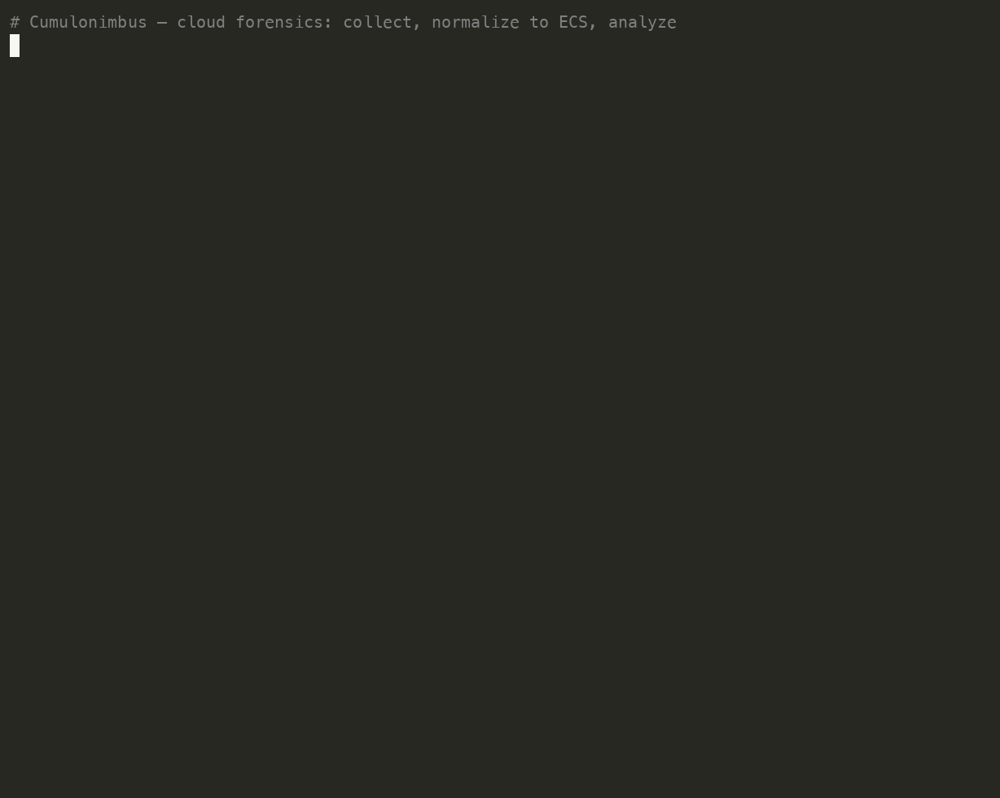
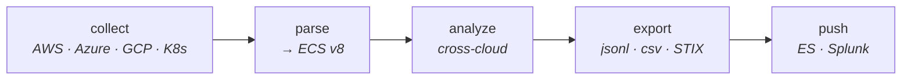

# Cumulonimbus

[](https://github.com/sltcnb/cumulonimbus/actions/workflows/ci.yml)

**Cloud forensics & incident-response toolkit.** Collects cloud-native logs and
artifacts from AWS, Azure, GCP, and Kubernetes, parses and normalizes them to
**Elastic Common Schema (ECS) v8**, runs cross-cloud analysis, and exports
timelines ready for Elasticsearch, Splunk, Sigma, STIX pipelines, or Citadel.

Named after the storm cloud — because that's usually what an IR engagement
looks like.

---

## Demo

<p align="center"></p>

## Architecture



## Table of contents

- [Why](#why)
- [Concepts](#concepts)
- [Install](#install)
- [Quick start](#quick-start)
- [Providers & datasets](#providers--datasets)
- [Command reference](#command-reference)
  - [`collect` (per provider)](#collect-per-provider)
  - [`parse`](#parse)
  - [`analyze`](#analyze)
  - [`export`](#export)
  - [`push`](#push)
  - [helpers](#helpers)
- [ECS data model](#ecs-data-model)
- [Analysis passes](#analysis-passes)
- [Authentication](#authentication)
- [IAM / least privilege](#iam--least-privilege)
- [Deployment](#deployment)
- [Detections (Sigma)](#detections-sigma)
- [Extending Cumulonimbus](#extending-cumulonimbus)
- [Testing](#testing)
- [Repository layout](#repository-layout)
- [Security notes](#security-notes)
- [Roadmap](#roadmap)
- [License](#license)

---

## Why

Cloud IR is manually intensive, provider-specific, and short on standardized
tooling. Consoles are siloed; commercial platforms are expensive. Cumulonimbus
is open, speaks all four major clouds, and emits a single normalized schema so
one timeline spans every provider — and drops straight into the tooling you
already run.

**Design principles**

- **Raw first.** `collect` writes provider-native evidence verbatim to
  `raw/`. Normalization is a separate, repeatable step — the original bytes are
  never mutated.
- **Offline parsing.** `parse`, `analyze`, and `export` need no cloud
  credentials and no network. Only `collect`/`push` talk to a provider.
- **One schema.** Everything becomes ECS v8, so AWS + Azure + GCP + K8s share a
  timeline, the same field names, and the same detections.
- **Fail soft.** A single malformed record or a broken enricher never aborts a
  run.

---

## Concepts

The tool is a three-stage pipeline plus analysis and export on top:

```
 collect  --▶  <case>/raw/*.jsonl        provider-native records, untouched
 parse    --▶  <case>/ecs/*.ecs.jsonl    ECS v8, enriched
 analyze  --▶  reports (tables / JSON)   timeline, users, network, IOCs, correlation
 export   --▶  timeline.csv | .jsonl | .stix | bulk.ndjson | citadel bundle
 push     --▶  Citadel / Splunk HEC / Elasticsearch
```

| Term | Meaning |
|------|---------|
| **Collector** | Fetches raw records from a provider API/log source; writes `raw/<dataset>.jsonl`. |
| **Parser** | Maps one native record -> a `ForensicEvent` (ECS). Registered by dataset name. |
| **Dataset** | A `provider.service` string, e.g. `aws.cloudtrail`. Also the raw filename stem — how `parse` picks a parser. |
| **Normalizer** | Enrichment pass: network direction always; opt-in GeoIP/ASN, reverse-DNS, and IOC matching. |
| **Exporter** | Serializes `ForensicEvent`s to jsonl/csv/STIX/ES-bulk/Citadel. |

---

## Install

Requires Python 3.9+.

```bash
pip install -e ".[aws]"      # + boto3
pip install -e ".[azure]"    # + azure-identity / azure-mgmt-monitor / requests
pip install -e ".[gcp]"      # + google-cloud-logging / google-cloud-securitycenter
pip install -e ".[k8s]"      # + kubernetes
pip install -e ".[all]"      # every provider SDK
pip install -e ".[dev]"      # pytest / pytest-cov / moto (development)
```

The base install (no extra) already runs `parse`, `analyze`, and file-based
`export` — you only need a provider extra to `collect` from that cloud.

---

## Quick start

```bash
# 1. Collect (needs AWS credentials)
cumulonimbus aws collect --service all \
  --profile prod --region us-east-1 \
  --start-time 2024-01-01T00:00Z \
  --output ./case/

# 2. Parse + normalize to ECS (offline)
cumulonimbus parse ./case/raw -o ./case

# 3. Analyze
cumulonimbus analyze ./case/ecs

# 4. Export a timeline
cumulonimbus export ./case/ecs -o timeline.csv --format csv
```

A case directory ends up looking like:

```
case/
|-- raw/                     # provider-native, verbatim
|   |-- aws.cloudtrail.jsonl
|   |-- aws.guardduty.jsonl
|   `-- aws.vpcflow.jsonl
`-- ecs/                     # normalized ECS v8
    |-- aws.cloudtrail.ecs.jsonl
    |-- aws.guardduty.ecs.jsonl
    `-- aws.vpcflow.ecs.jsonl
```

---

## Providers & datasets

| Provider | Datasets | Collect source |
|----------|----------|----------------|
| **AWS** | `aws.cloudtrail`, `aws.guardduty`, `aws.vpcflow`, `aws.s3access`, `aws.ec2`, `aws.iam`, `aws.lambda`, `aws.rds` | boto3 (LookupEvents, GuardDuty, Describe\*), S3 log objects |
| **Azure** | `azure.activity`, `azure.signin`, `azure.audit`, `azure.nsgflow` | azure-mgmt-monitor, Microsoft Graph |
| **GCP** | `gcp.audit`, `gcp.vpcflow`, `gcp.scc` | Cloud Logging, Security Command Center |
| **Kubernetes** | `k8s.audit`, `k8s.event`, `k8s.container`, `k8s.etcd` | audit log file, CoreV1 events, pod/container inventory, decoded etcd snapshot |

`cumulonimbus parsers` prints every registered parser.

VPC Flow (AWS) and NSG Flow (Azure) also accept **raw log lines** directly, so
logs delivered to S3/Storage can be parsed without a structured collector.

---

## Command reference

### `collect` (per provider)

Each provider is a command group. All write to `<output>/raw/`.

```bash
# AWS — API-based services
cumulonimbus aws collect \
  --service {cloudtrail|guardduty|ec2|iam|lambda|rds|all} \
  [--profile NAME] [--region REGION] \
  [--start-time ISO8601] [--end-time ISO8601] \
  -o ./case/

# AWS — logs delivered to an S3 bucket (access logs or VPC flow logs)
cumulonimbus aws collect-s3 \
  --bucket my-log-bucket [--prefix path/] \
  --dataset {aws.s3access|aws.vpcflow} \
  [--profile NAME] [--region REGION] \
  -o ./case/

# Azure
cumulonimbus azure collect \
  --service {activity|signin|audit|all} \
  [--subscription SUB_ID] [--tenant TENANT_ID] \
  [--start-time ISO8601] [--end-time ISO8601] \
  -o ./case/

# GCP
cumulonimbus gcp collect \
  --service {audit|vpcflow|scc|all} \
  --project PROJECT_ID \
  [--start-time ISO8601] [--end-time ISO8601] \
  -o ./case/

# Kubernetes
cumulonimbus k8s collect --service event     [--kubeconfig PATH] [--in-cluster] -o ./case/
cumulonimbus k8s collect --service container [--kubeconfig PATH] [--in-cluster] -o ./case/
cumulonimbus k8s collect --service audit     --audit-log /var/log/kube-audit.log  -o ./case/
cumulonimbus k8s collect --service etcd      --etcd-export ./etcd-decoded.jsonl    -o ./case/
```

Times are ISO-8601; a trailing `Z` or no timezone is treated as UTC.

**Container & etcd forensics.** `k8s.container` inventories every running
container (image, privileged flag, host-path mounts, restart counts) mapped to
ECS `container.*`. `k8s.etcd` ingests a **decoded** etcd snapshot — etcd is a
binary bolt DB holding all API objects at rest, including Secrets, so decode a
`etcdctl snapshot save` file with a tool like `auger extract` first, then feed
the JSON `{key, value}` objects. Secret material at rest is flagged
(`k8s.contains_secret_material`, `k8s.data_keys`).

### `parse`

```bash
cumulonimbus parse RAW_DIR -o OUTPUT_DIR [--dataset NAME]
```

- Reads every `*.jsonl` in `RAW_DIR`, infers the parser from each file's stem
  (`aws.cloudtrail.jsonl` -> `aws.cloudtrail`), normalizes, and writes
  `OUTPUT_DIR/ecs/<dataset>.ecs.jsonl`.
- Point `RAW_DIR` at the `raw/` folder created by `collect`.
- `--dataset` forces one parser for all files (useful for oddly-named inputs).

**Enrichment** (opt-in flags on `parse`):

```bash
cumulonimbus parse ./case/raw -o ./case \
  --geoip-city GeoLite2-City.mmdb --geoip-asn GeoLite2-ASN.mmdb \
  --rdns \
  --ioc iocs.txt
```

| Flag | Effect |
|------|--------|
| `--geoip-city` / `--geoip-asn` | fill `source/destination.geo.*` and `.as_number` from MaxMind DBs (needs `[geoip]` extra) |
| `--rdns` | reverse-DNS public IPs into `.domain` (cached; makes network lookups) |
| `--ioc FILE` | flag events whose src/dst IP matches an indicator; sets `threat.matched` and elevates `event.kind` to `alert`. FILE is IP-per-line or a STIX 2.x bundle |

Network-direction tagging always runs. Enrichers are best-effort — a lookup
failure never aborts the run.

### `analyze`

```bash
cumulonimbus analyze ECS_INPUT [--report REPORT] [--json] [--limit N]
```

`ECS_INPUT` is a directory of `*.ecs.jsonl` or a single file. Reports:

| `--report` | Output |
|------------|--------|
| `all` (default) | users + network + privesc + exfil + correlate |
| `timeline` | every event sorted by `@timestamp` |
| `users` | per-principal action counts, source IPs, failures, first/last seen |
| `network` | top talkers by bytes (`--limit` rows) |
| `privesc` | CloudTrail events matching known IAM privilege-escalation techniques |
| `exfil` | large outbound flows + bulk S3 read activity |
| `correlate` | same identity or source IP seen across ≥2 cloud providers |

`--json` emits machine-readable output instead of Rich tables.

### `export`

```bash
cumulonimbus export ECS_INPUT -o OUTPUT --format FMT [--gzip] [--es-index NAME] [--case-id ID]
```

| `--format` | Notes |
|------------|-------|
| `jsonl` (default) | one ECS doc per line; `--gzip` supported |
| `csv` | flattened analyst columns; `--gzip` supported |
| `stix` | STIX 2.1 bundle (IP observables + observed-data, deterministic IDs) |
| `es-bulk` | Elasticsearch `_bulk` NDJSON; index via `--es-index` |
| `citadel` | Citadel ingest bundle (`citadel.bundle.v1`); tag with `--case-id` |

### `push`

Send normalized events straight to a platform over HTTP.

```bash
cumulonimbus push ECS_INPUT --target citadel \
  --url https://citadel.local/api/ingest --token $TOKEN --case-id C-42

cumulonimbus push ECS_INPUT --target splunk-hec \
  --url https://splunk:8088/services/collector --token $HEC_TOKEN

cumulonimbus push ECS_INPUT --target es-bulk \
  --url https://es:9200 --token $API_KEY --es-index cases
```

`--no-verify` disables TLS verification (lab use only).

### helpers

```bash
cumulonimbus parsers        # list every registered parser
cumulonimbus iam-policy     # print the minimum AWS IAM policy (JSON)
cumulonimbus --version
```

---

## ECS data model

Every parser emits a `ForensicEvent` (see `cumulonimbus/ecs/schema.py`), a
pydantic model over an ECS v8 subset. Provider-specific fields are preserved
under the `aws` / `azure` / `gcp` namespaces (and a `k8s` extra namespace);
empty values are pruned on export.

**CloudTrail -> ECS**

```json
{
  "@timestamp": "2024-01-15T10:30:00Z",
  "event": { "action": "ConsoleLogin", "category": ["authentication"],
             "type": ["access"], "outcome": "success", "provider": "aws",
             "kind": "event", "dataset": "aws.cloudtrail" },
  "user": { "name": "admin", "id": "AIDACKCEVSQ6C2EXAMPLE" },
  "source": { "ip": "203.0.113.42" },
  "cloud": { "provider": "aws", "account_id": "123456789012",
             "region": "us-east-1", "service_name": "signin.amazonaws.com" },
  "aws": { "cloudtrail": { "event_source": "signin.amazonaws.com",
                           "event_name": "ConsoleLogin", "read_only": false } }
}
```

**VPC Flow -> ECS**

```json
{
  "@timestamp": "2024-01-15T10:30:00Z",
  "event": { "action": "ACCEPT", "category": ["network"],
             "type": ["connection"], "outcome": "success", "provider": "aws" },
  "source": { "ip": "10.0.1.42", "port": 54321 },
  "destination": { "ip": "198.51.100.10", "port": 443 },
  "network": { "transport": "tcp", "protocol": "6", "bytes": 1024,
               "packets": 10, "direction": "outbound" },
  "aws": { "vpc": { "interface_id": "eni-12345678" } }
}
```

Outcome, category, and event.type are normalized consistently across providers
(e.g. a failed sign-in is `outcome: "failure"` whether it's AWS, Azure, or GCP).

**Kubernetes** maps to ECS `orchestrator.*` and `container.*` rather than a
provider namespace:

```json
{
  "event": { "action": "get:secrets", "provider": "kubernetes",
             "dataset": "k8s.audit", "outcome": "success" },
  "user": { "name": "system:anonymous" },
  "orchestrator": { "type": "kubernetes", "namespace": "kube-system",
                    "resource": { "type": "secrets", "name": "admin-token" } },
  "k8s": { "verb": "get", "sensitive": true, "response_code": 200 }
}
```

A small `k8s` extra namespace carries forensics details ECS has no field for
(verb, response code, sensitivity/privileged flags, etcd metadata).

---

## Analysis passes

All live in `cumulonimbus/core/analysis.py` as pure functions over ECS dicts —
importable and testable on their own.

- **`timeline`** — merge all events into one chronological sequence.
- **`user_activity`** — per-principal action histogram, source IPs, failure
  count, first/last seen.
- **`top_talkers`** — network flows aggregated by (src, dst, dport), ranked by
  bytes.
- **`privesc_indicators`** — flags IAM API calls in a known
  privilege-escalation set (`PutUserPolicy`, `AttachUserPolicy`,
  `CreateAccessKey`, `UpdateAssumeRolePolicy`, …).
- **`exfil_indicators`** — large outbound transfers (default ≥ 100 MB) plus
  bulk S3 read APIs.
- **`correlate_identities`** — the cross-cloud pivot: the same principal
  (domain-stripped) or source IP appearing in more than one provider. This is
  what turns four separate log sets into one incident.

---

## Authentication

| Provider | Methods |
|----------|---------|
| **AWS** | named profile (`--profile`), env vars, instance/task role, cross-account assume-role, MFA — anything a `boto3.Session` resolves. |
| **Azure** | `DefaultAzureCredential`: env vars (service principal), managed identity, Azure CLI, VS Code. Sign-in/audit logs use a Graph token. |
| **GCP** | Application Default Credentials or a service-account JSON key via `GOOGLE_APPLICATION_CREDENTIALS`. |
| **Kubernetes** | kubeconfig (`--kubeconfig`) or in-cluster service account (`--in-cluster`). Audit logs read from a file path. |

Credentials are never written to disk or logged.

---

## IAM / least privilege

`cumulonimbus iam-policy` prints the minimum read-only AWS policy the
collectors need (also in `cumulonimbus/providers/aws/iam_permissions.py`) —
CloudTrail `LookupEvents`, GuardDuty list/get, EC2/IAM/Lambda/RDS `Describe`/
`List`, and S3 read for log buckets. Attach it to a dedicated IR role.

---

## Deployment

### Docker

```bash
docker run -v $(pwd)/output:/data -e AWS_PROFILE=prod \
  sltcnb/cumulonimbus:latest aws collect --service all --output /data
```

The image runs as a non-root user.

### Kubernetes Job

```bash
kubectl apply -f k8s/job.yaml
```

Reads credentials from a `aws-creds` Secret, writes to a
`cumulonimbus-output` PVC. Hardened `securityContext` (non-root, no privilege
escalation, read-only root FS).

### Helm

```bash
helm install ir ./k8s/helm \
  --set provider=aws --set service=all \
  --set schedule="0 */6 * * *" \
  --set credentialsSecret=cloud-creds
```

Renders a `CronJob` when `schedule` is set, otherwise a one-shot `Job`. Works
for any provider by flipping `--set provider=`.

---

## Detections (Sigma)

Pre-built rules in `sigma/`:

| Rule | Fires on |
|------|----------|
| `aws_root_console_login.yml` | root account console authentication |
| `k8s_secret_access_anonymous.yml` | anonymous/unauthenticated principal reading Secrets |
| `multicloud_impossible_travel.yml` | one identity/IP active across multiple clouds |

Rules match on ECS field names, so they run against exported jsonl or your SIEM
after ingest.

---

## Extending Cumulonimbus

Add a dataset in two steps.

**1. A parser** — subclass `Parser`, register it by dataset name:

```python
from cumulonimbus.core.parser import Parser, register
from cumulonimbus.ecs.schema import Event, ForensicEvent

@register("aws.route53")
class Route53Parser(Parser):
    def parse_record(self, record):
        if "query_name" not in record:
            return None            # returning None skips the record
        return ForensicEvent(
            **{"@timestamp": record["query_timestamp"]},
            event=Event(action="dns_query", category=["network"],
                        provider="aws", dataset="aws.route53"),
            # ...
        )
```

Import the module from its provider `parsers/__init__.py` so the decorator runs.
`parse` now handles `aws.route53.jsonl` automatically.

**2. A collector** (optional, for live fetch) — subclass `Collector`, set
`dataset`, implement `collect()` to yield raw dicts, and add it to the
provider's `COLLECTORS` map. `collect_to()` handles streaming to disk.

---

## Testing

```bash
pip install -e ".[dev]"
pytest -q
```

58 unit tests cover every parser (with golden fixtures), the normalizer, all
analysis passes, every export encoder, the enrichers, and all collectors. AWS
collectors run end-to-end against **moto**-mocked APIs (EC2, IAM, S3, Lambda,
RDS); Azure/GCP/Kubernetes collectors run against injected fake SDK modules;
file-based K8s collectors (audit, etcd) are tested directly. Also run in CI on
Python 3.9–3.12 with a ruff lint gate.

---

## Repository layout

```
cumulonimbus/
|-- pyproject.toml
|-- Dockerfile
|-- k8s/
|   |-- job.yaml
|   `-- helm/                     # Chart.yaml, values.yaml, templates/cronjob.yaml
|-- sigma/                        # detection rules
|-- cumulonimbus/
|   |-- cli.py                    # Click CLI: collect / parse / analyze / export / push
|   |-- core/
|   |   |-- collector.py          # Collector base
|   |   |-- parser.py             # Parser base + registry
|   |   |-- normalizer.py         # enrichment
|   |   |-- analysis.py           # timeline / users / privesc / exfil / correlate
|   |   |-- exporter.py           # streaming jsonl / csv
|   |   `-- exports.py            # STIX / ES-bulk / Citadel encoders
|   |-- ecs/
|   |   `-- schema.py             # ForensicEvent (ECS v8)
|   `-- providers/
|       |-- aws/   { collectors/, parsers/, iam_permissions.py }
|       |-- azure/ { collectors/, parsers/ }
|       |-- gcp/   { collectors/, parsers/ }
|       `-- k8s/   { collectors/, parsers/ }
`-- tests/
    |-- unit/                     # parsers, analysis, exports, multicloud
    `-- fixtures/
```

---

## Security notes

- **Read-only.** Collectors only read cloud state. No mutation, no response
  actions.
- **Credentials.** Never logged, never written to output.
- **Raw preservation.** `collect` stores evidence verbatim; parsing is
  downstream and repeatable, keeping a clean chain of custody.
- **TLS.** `push` verifies TLS by default; `--no-verify` is lab-only.

---

## Roadmap

- SaaS audit logs (Okta, GitHub, Microsoft 365)
- Incremental collection (bookmark last run per dataset)
- Forensic snapshot automation (EBS / Azure Disk / GCE Disk)
- Container/etcd forensics for Kubernetes
- Anomaly detection on user behavior and network flows

---

## License

Apache-2.0
